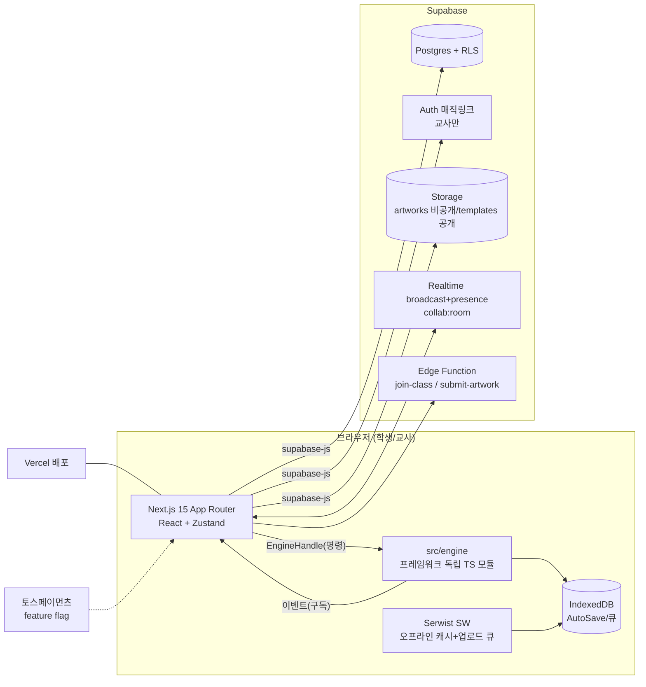
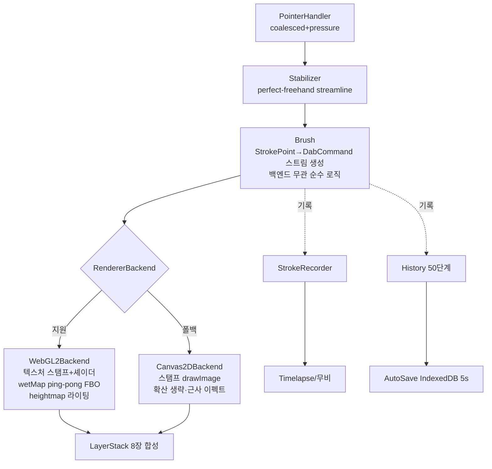
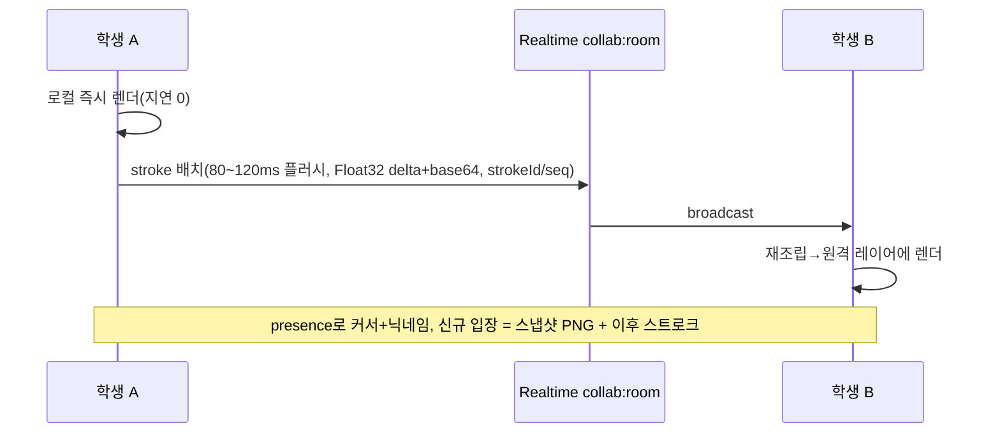

# ArtON 아키텍처 (Phase 0 산출물)

## 전체 구성

## 엔진 핵심 설계: 백엔드 독립 dab 스트림

이중 구현(브러시 12종 × 백엔드 2종 = 24 조합) 폭발을 막는 구조:

- **Brush**: `strokeStart/strokeMove/strokeEnd(point) → DabCommand[]` 순수 함수적 생성기. DabCommand = `{x,y,size,opacity,color,rotation,texture,blend,special?}`. 단위 테스트가 백엔드 없이 가능.
- **RendererBackend 인터페이스**: `drawDabs(layer, dabs)`, `beginStroke/endStroke(layer, blend)`, `composite()`, `readPixels()`, 능력 플래그 `caps: {wetSim, heightmap, additive}`.
- **수채(WebGL2)**: wetMap = 캔버스 1/2 해상도 RG half-float 텍스처(R=물, G=안료), rAF당 2회 3x3 커널 확산 shader(ping-pong), 5초 건조 타이머, edge darkening은 건조 시 G 채널 경사 기반. Canvas2D 폴백은 caps.wetSim=false → 확산 생략 multiply.
- **유화(WebGL2)**: heightmap R16F, bristle 스트릭은 dab 텍스처 회전, smudge pickup 30%는 스탬프 전 readback 캐시(퍼픽셀 readPixels 금지 — 스트로크당 1회 지역 read).
- **History**: Command 패턴, 스트로크 단위. 스냅샷은 레이어별 타일(256px) 더티-타일만 보관해 8레이어 50단계 메모리 폭발 방지.
- **협동 undo**: 자기 스트로크만 undo 가능(잠금 단순화). 원격 스트로크는 History에 안 쌓임.

## 색칠 모드 경계 잠금
- 라인아트 = 별도 상단 고정 레이어(multiply). FillTool/브러시의 경계 = 라인아트 알파+휘도 임계값 마스크. flood fill은 scanline + tolerance 32 + 라인 픽셀을 벽으로 취급.

## 협동 캔버스 데이터 흐름

## 인증/권한 모델
- 교사 = Supabase Auth(매직링크). RLS: `teacher_id = auth.uid()` 자기 학급 체인만.
- 학생 = **계정 없음**. Edge Function `join-class`(코드 검증→students row→서명된 학생 토큰 발급). 이후 쓰기(작품 제출)는 Edge Function 경유로만 — anon 직접 INSERT는 RLS로 전부 차단. 코드 브루트포스는 EF 레벨 rate limit + 코드 문자셋(혼동 문자 제외 32^6).
- Storage: artworks 비공개(서명 URL, 교사/본인 학급만), templates 공개 읽기.

## 성능 예산 (크롬북 4GB)
- 스트로크 지연 < 40ms: pointerdown→첫 dab 렌더까지 계측(performance.now, `window.__arton_perf`).
- 60fps: rAF 루프에서 dab 배치 렌더 + 수채 확산 2패스 + 합성 1패스. 레이어 합성은 더티 영역만.
- 메모리: 레이어 8장 × 2048² RGBA ≈ 134MB가 상한 → 기본 캔버스 1536×1152, 타일 스냅샷.
